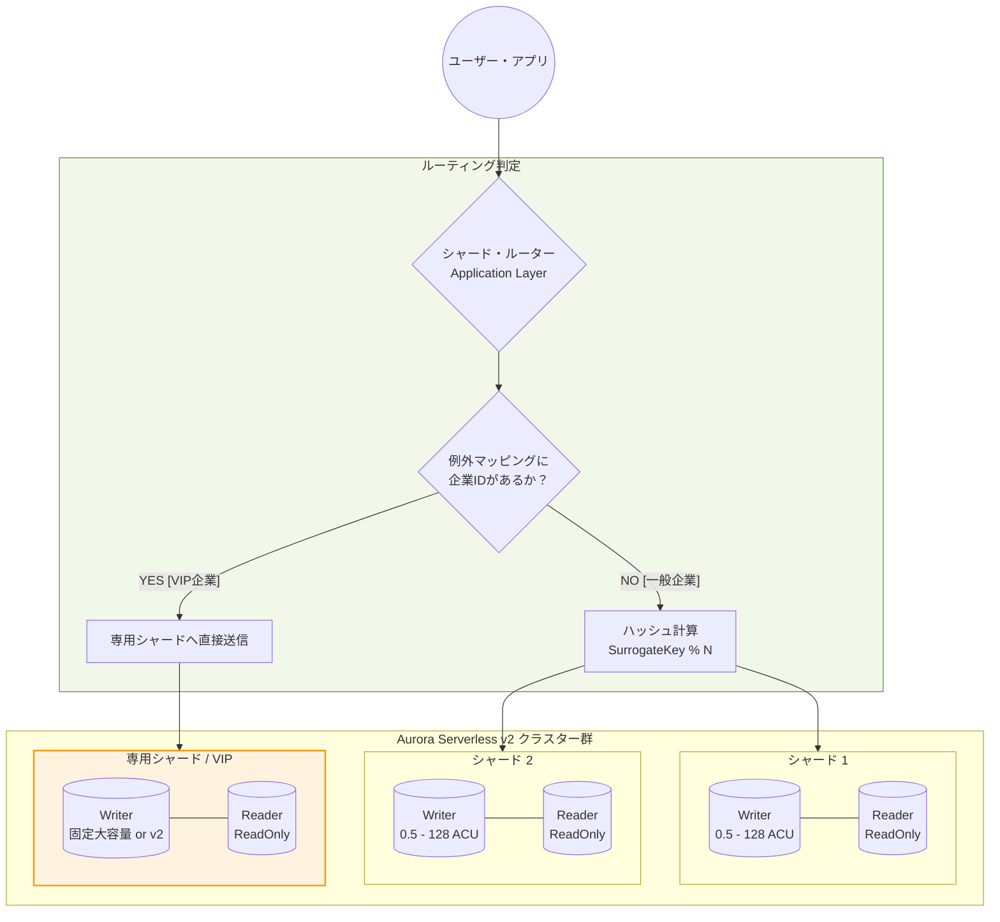

# 企業作成時のシャーディングについて説明

## アーキテクチャ図

```mermaid
graph TD

    %% ユーザー・リクエスト層

    User((ユーザー・アプリ)) --> Router{シャード・ルーター<br/>Application Layer}

    %% ルーティング・ロジック

    subgraph Routing_Logic [ルーティング判定]

        Router --> Lookup{例外マッピングに<br/>企業IDがあるか？}

        Lookup -- YES [VIP企業] --> VIP_Shard[専用シャードへ直接送信]

        Lookup -- NO [一般企業] --> Hash[ハッシュ計算<br/>SurrogateKey % N]

    end

    %% シャーディング層 (Aurora Serverless v2)

    subgraph Aurora_Shards [Aurora Serverless v2 クラスター群]

        

        subgraph Shard_1 [シャード 1]

            S1_Writer[(Writer<br/>0.5 - 128 ACU)]

            S1_Reader[(Reader<br/>ReadOnly)]

            S1_Writer --- S1_Reader

        end

        subgraph Shard_2 [シャード 2]

            S2_Writer[(Writer<br/>0.5 - 128 ACU)]

            S2_Reader[(Reader<br/>ReadOnly)]

            S2_Writer --- S2_Reader

        end

        subgraph Shard_VIP [専用シャード / VIP]

            SV_Writer[(Writer<br/>固定大容量 or v2)]

            SV_Reader[(Reader<br/>ReadOnly)]

            SV_Writer --- SV_Reader

        end

    end

    %% 接続の割り当て

    Hash --> Shard_1

    Hash --> Shard_2

    VIP_Shard --> Shard_VIP

    %% 注釈

    style Shard_VIP fill:#fff3e0,stroke:#ff9800,stroke-width:2px

    style Routing_Logic fill:#f1f8e9,stroke:#558b2f  

```  
